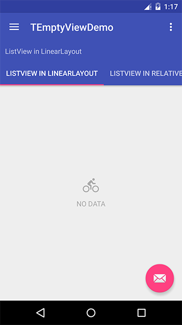
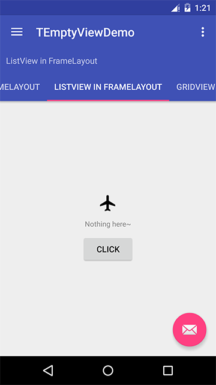

[中文说明在这里](./README.cn.md)

# TEmptyView

Just a Wheel—— A easier way to setEmptyView. Without having to write xml file every time. It supports AdapterView(ListView,GridView,etc) and RecyclerView. 
[](https://android-arsenal.com/details/1/3886)

## Dependency
```groovy
	compile 'com.barryzhang:temptyview:0.0.1'
```

## Usage

### I. Initialize
initialize some custom attributes —— this step is not necessary, if you don't do it, it will use the default settings.

```java
TEmptyView.init(TViewUtil.EmptyViewBuilder.getInstance(context)
       .setShowText(true)
       .setEmptyText("NO DATA")
       .setShowButton(false)
       ...
       .setShowIcon(true));
```

### II. Set EmptyView

#### 1.simple
```java
    TViewUtil.setEmptyView(listView)
```


#### 2.custom 
The view of TEmptyView is made of 3 parts: ImageView、TextView、Button. You can custom each of it.  
```java
TViewUtil.EmptyViewBuilder.getInstance(this)
	.setEmptyText("Nothing here~")
	.setEmptyTextSize(12)
	.setEmptyTextColor(Color.GRAY)
	.setIconDrawable(drawableAirplan)
	.setShowButton(true)
	.setActionText("Click")
	.setAction(new View.OnClickListener() {
		@Override
		public void onClick(View view) {
		    Toast.makeText(getApplicationContext(),
		            "Yes, clicked~",Toast.LENGTH_SHORT).show();
		}
	})
	.bindListView(listView);
```



## Other

#### 1.RecyclerView
Usage of RecyclerView is the same as AdapterView, but you must call `setAdapter` first.
```
	recyclerView.setAdapter(adapter);
	TViewUtil.EmptyViewBuilder.getInstance(getContext())
           .setEmptyText("This is a empty view in RecyclerView")
           ...
           .bindListView(recyclerView);
```

#### 2.Tips

If you din't call `TEmptyView.init(..)` in Application's onCreate method(This is recommend but not necessary), It is better to use Application as context instead of Activity, otherwise may easily cause memory leak.


*Please excuse my poor English :)*


License 
--------

    Copyright 2016 Barry Zhang

    Licensed under the Apache License, Version 2.0 (the "License");
    you may not use this file except in compliance with the License.
    You may obtain a copy of the License at

       http://www.apache.org/licenses/LICENSE-2.0

    Unless required by applicable law or agreed to in writing, software
    distributed under the License is distributed on an "AS IS" BASIS,
    WITHOUT WARRANTIES OR CONDITIONS OF ANY KIND, either express or implied.
    See the License for the specific language governing permissions and
    limitations under the License.